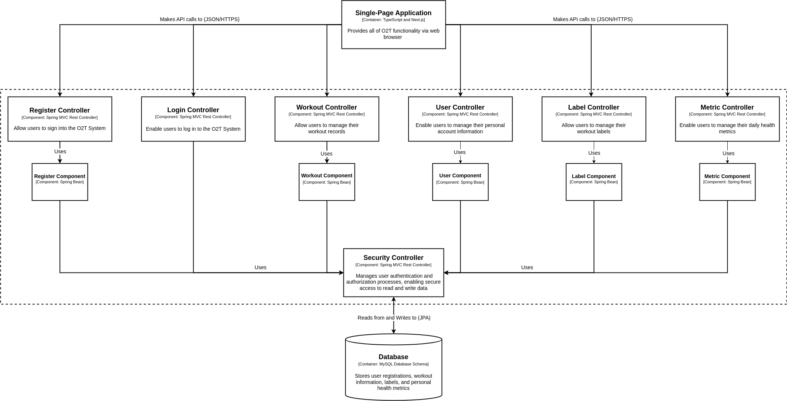

# **O2T - Olympics Training Tracker**

Projeto de conclusão de curso para a disciplina de Engenharia de Software (MC656), que propõe uma aplicação web para auxiliar atletas olímpicos, oferecendo funcionalidades como rastreamento de treinos, monitoramento de métricas de saúde e planejamento semanal.

## **Membros**

- Luiz Fernando Lima Leite - 248405
- Luiz Guilherme Sousa Nascimento - 230667
- Victor Wu - 231467
- Vítor Paziam Magalhães - 238316

## **Código**

A codificação do software consiste em uma aplicação web separada em três componentes essenciais:

- Banco de Dados (MySQL)
- Backend (Java Spring Boot)
- Frontend (Next.js)
Cada parte possui um contêiner Docker específico, o que permite a independência e modularização do software, facilitando o desenvolvimento.

## **Equipe**

Os membros foram divididos em 2 grupos:

- Desenvolvimento Backend e Banco de Dados (Luiz Guilherme Sousa Nascimento e Vítor Paziam Magalhães)
- Desenvolvimento Frontend (Victor Wu e Luiz Fernando Lima Leite)

## **Arquitetura do Projeto**

### Diagrama em Nível de Componentes (C4 - Nível 3)

### Estilos Adotados na Arquitetura

A arquitetura do projeto O2T adota os seguintes estilos arquiteturais:

- **Client-Server:** Separa claramente as responsabilidades entre o cliente (frontend) e o servidor (backend). No projeto, o frontend, desenvolvido em Next.js, fornece uma interface de usuário que se comunica com o backend via chamadas HTTP. O backend, implementado em Spring Boot, processa a lógica de negócios, interage com o banco de dados e retorna os dados necessários para o frontend.
- **SOA (Service-Oriented Architecture) com RESTful APIs:** O backend expõe serviços através de APIs RESTful, permitindo que o frontend consuma esses serviços de maneira padronizada. Cada endpoint RESTful é responsável por realizar operações CRUD sobre os recursos da aplicação.
- **MVC (Model-View-Controller):** Este padrão divide a aplicação em três componentes principais:
    - **Model:** Representa os dados da aplicação e as regras de negócios associadas. No Spring Boot, isso é gerenciado por meio de entidades JPA que mapeiam diretamente para as tabelas do banco de dados (MySQL).
    - **View:** Refere-se ao frontend, componente independente desenvolvido em Next.js, que se comunica com o backend através de dados processados no formato JSON.
    - **Controller:** Recebe as entradas do usuário via HTTP, interage com os serviços (lógica de negócios) e retorna a resposta adequada. A nível de implementação, o Spring Boot utiliza uma divisão entre *Controllers*, que manipulam as requisições HTTP, delegando a lógica de negócios aos serviços, *Services*, que contêm a lógica de negócios da aplicação, sendo responsáveis por implementar as operações necessárias, e *Repositories*, que interagem diretamente com o banco de dados, executando operações CRUD e utilizando o Spring Data JPA para facilitar o acesso aos dados persistentes.

### Descrição dos Componentes e Suas Responsabilidades

- **Register:**
    - **Controller:** Trata o registro e validação de novos usuários na aplicação. Recebe os dados de registro, valida e chama o serviço para persistir os novos usuários.
    - **Component:** Implementa a lógica de registro de usuários, interagindo com o repositório para salvar as informações no banco de dados.

- **Workout:**
    - **Controller:** Lida com a criação, deleção e edição dos registros de treinos dos usuários. Recebe requisições para manipulação dos dados de treino e delega as operações para o serviço correspondente.
    - **Component:** Contém a lógica de negócios para gerenciar treinos, incluindo validações e interações com o repositório para operações CRUD.

- **User:**
    - **Controller:** Permite a edição e atualização dos dados dos usuários já registrados. Recebe requisições para atualização dos dados do usuário e chama o serviço responsável.
    - **Component:** Implementa a lógica para gerenciar as informações dos usuários, garantindo a integridade e consistência dos dados ao interagir com o repositório.

- **Label:**
    - **Controller:** Gerencia a criação, deleção e edição de labels/identificadores de treinos. Recebe e processa requisições relacionadas a labels de treino.
    - **Component:** Contém a lógica de negócios para manipulação de labels, realizando operações no banco de dados através do repositório.

- **Metric:**
    - **Controller:** Lida com a criação, deleção e edição dos registros das métricas de saúde dos usuários. Recebe requisições para manipular os dados de métricas de saúde e delega as operações ao serviço correspondente.
    - **Component:** Gerencia as métricas de saúde dos usuários, interagindo com o repositório para operações CRUD.

- **Login Controller:** Gerencia o processo de autenticação e login de usuários. Utiliza o componente Security Controller para autenticar e autorizar usuários.

- **Security Controller:** Gerencia a autenticação e autorização dos usuários, garantindo acesso seguro para leitura e escrita de dados. Processa requisições de login e controle de acesso.

- **Single-Page Application:** Desenvolvida em Next.js, fornece toda a funcionalidade do O2T através de um navegador web, fazendo chamadas de API (JSON/HTTPS) para o backend Spring Boot.

- **MySQL Database:** Armazena todos os dados persistentes do sistema, incluindo informações de usuários, treinos, labels e métricas de saúde. O banco de dados é acessado pelos repositórios dos componentes para realizar operações de leitura e escrita.
